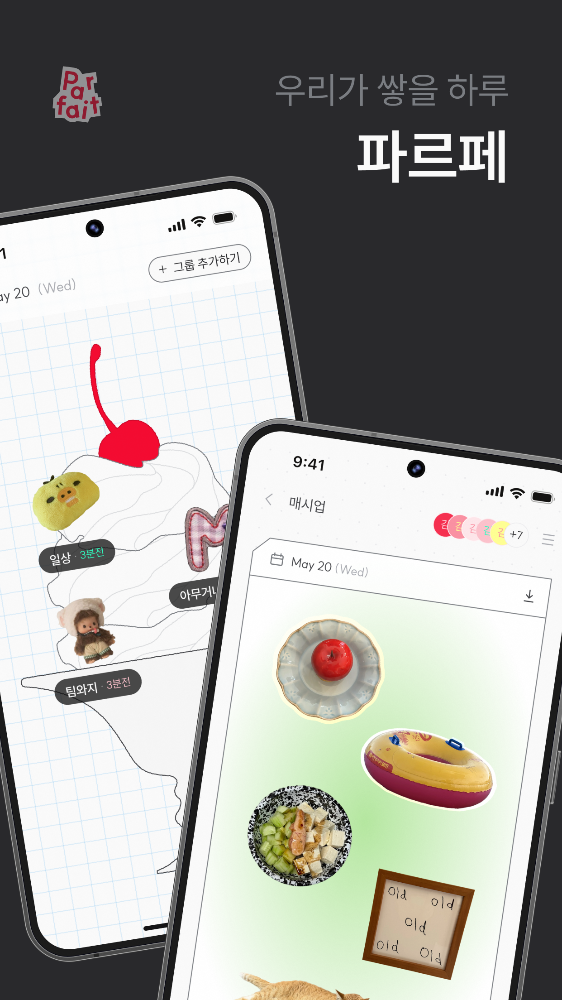
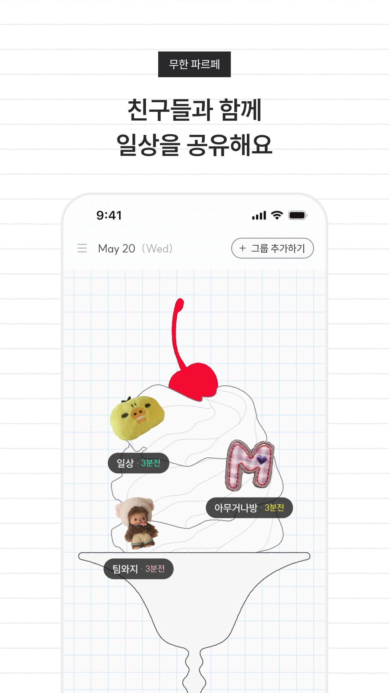
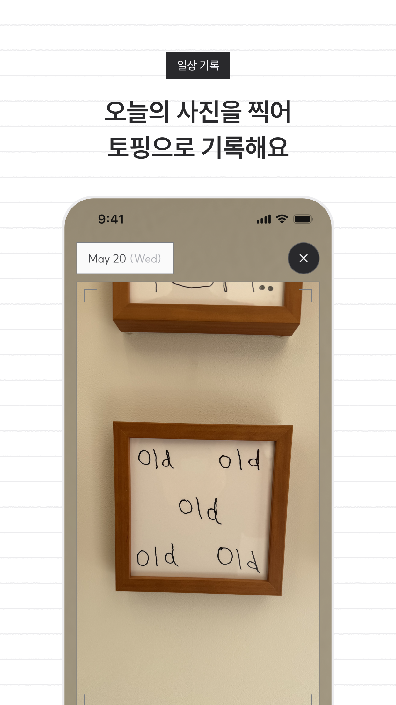
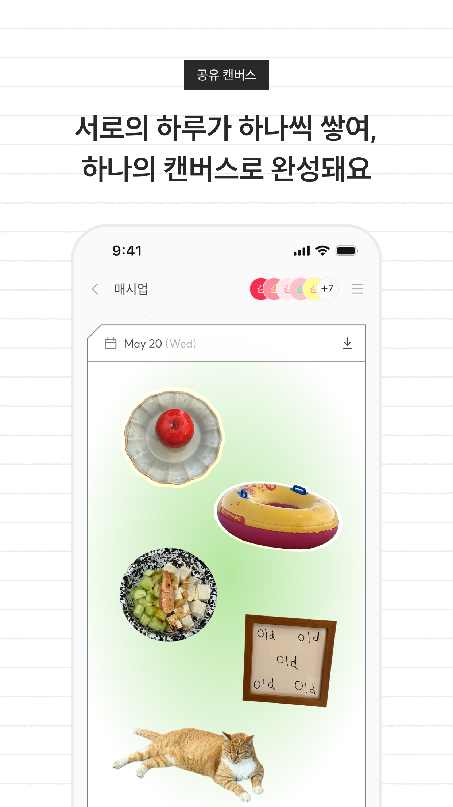

# Parfait


<div align="center">

</div>

<div align="center">

</div>

<div align="center">

**Parfait 사진 공유 캔버스 SNS**

친구들과 함께 일상을 공유해요. 오늘의 사진을 찍어 토핑으로 기록해요. 서로의 하루가 하나씩 쌓여, 하나의 캔버스로 완성돼요.

<br />

<a href="https://play.google.com/store/apps/details?id=com.teamyg.parfait"></a>


<br />

<a href="https://github.com/mash-up-kr/TEAMYG-Android/actions/workflows/test.yml"></a>
<a href="https://github.com/mash-up-kr/TEAMYG-Android/actions/workflows/ktlint.yml"></a>


<br />

</div>

## 📥 다운로드

[Google Play 스토어](https://play.google.com/store/apps/details?id=com.teamyg.parfait)에서 받을 수 있습니다.

<br />


## 🍒 주요 기능

<div align="center">

| 무한 파르페 |                                  일상 기록                                   | 공유 캔버스 |
|:---:|:------------------------------------------------------------------------:|:---:|
|  |  |  |
| 참여한 그룹이 파르페로 쌓입니다. 최근 활동 순으로 토핑이 배치되고, 그룹이 늘어날수록 파르페도 함께 자랍니다. |           오늘의 사진을 찍으면 피사체만 자동으로 잘라내 토핑으로 만듭니다. 직접 편집할 수도 있습니다.           | 서로 올린 토핑이 하루치 캔버스에 모입니다. 캔버스는 매일 03시에 마감되고 새 하루가 시작됩니다. |

</div>

<br />

<div align="center">

</div>

https://github.com/user-attachments/assets/842d30c5-665a-401b-adb7-1b8f5b241658

https://github.com/user-attachments/assets/98fd44c5-935f-4207-a45a-6282f05b0d05

<br />


## 👥 팀원

<div align="center">

</div>

<br />

<div align="center">

<table>
<tr>

<td align="center">

<br />
<b>전희훈</b>
<br />
<sub>👑 대 장 님 👑</sub>
</td>

<td align="center">

<br />
<b>문설빈</b>
<br />
<sub>인턴1</sub>
</td>

<td align="center">

<br />
<b>전계원</b>
<br />
<sub>인턴2</sub>
</td>


</tr>
</table>

</div>

<br />


## ⚒️ 기술 스택

<div align="center">


<br />

<br />


<br />

<br />


<br />

<br />


</div>

<br />

- **언어, 비동기** — [Kotlin](https://kotlinlang.org/), [Coroutines](https://github.com/Kotlin/kotlinx.coroutines) + Flow, [kotlinx.serialization](https://github.com/Kotlin/kotlinx.serialization), [kotlinx-datetime](https://github.com/Kotlin/kotlinx-datetime)
- **UI** — [Jetpack Compose](https://developer.android.com/jetpack/compose)(BOM) + Material 3, [Navigation 3](https://developer.android.com/guide/navigation/navigation-3), [Coil 3](https://github.com/coil-kt/coil), [Haze](https://github.com/chrisbanes/haze)(블러), [Lottie](https://github.com/airbnb/lottie-android)
- **의존성 주입** — [Hilt](https://dagger.dev/hilt/)
- **네트워크** — [Retrofit](https://github.com/square/retrofit) + [OkHttp](https://github.com/square/okhttp), kotlinx.serialization 컨버터
- **카메라, 이미지** — [CameraX](https://developer.android.com/training/camerax), [ML Kit Subject Segmentation](https://developers.google.com/ml-kit/vision/subject-segmentation)(토핑 누끼), [ExifInterface](https://developer.android.com/reference/androidx/exifinterface/media/ExifInterface)
- **저장, 인증** — [DataStore](https://developer.android.com/topic/libraries/architecture/datastore), [Kakao SDK](https://developers.kakao.com/docs/latest/ko/kakaologin/android)(로그인)
- **관측** — [Firebase](https://firebase.google.com/) Analytics·Crashlytics, [Kermit](https://github.com/touchlab/Kermit)(로깅 추상화)
- **테스트** — [JUnit4](https://junit.org/junit4/), [kotlin.test](https://kotlinlang.org/api/latest/kotlin.test/), [MockK](https://mockk.io/), [Turbine](https://github.com/cashapp/turbine), [MockWebServer](https://github.com/square/okhttp/tree/master/mockwebserver), Compose UI Test
- **빌드, 품질** — [Gradle 컨벤션 플러그인](build-logic), [버전 카탈로그](gradle/libs.versions.toml), [ktlint](https://github.com/JLLeitschuh/ktlint-gradle), GitHub Actions

<br />


## 📦 패키지 구조

```text
　　　 ∧＿∧
　　　( ･ω･｡)つ━☆・*。
　　　⊂　  ノ 　　　・゜+.
　　　 しーＪ　　　°。+ *´¨)
　　　　　　　　　.· ´¸.·*´¨) ¸.·*¨)
　　　　　　　　　(¸.·´ (¸.·'*    com.teamyg.parfait
                                 ├── build-logic
                                 ├── app
                                 ├── app-preview
                                 ├── core
                                 │   ├── designsystem
                                 │   ├── ui
                                 │   ├── navigation
                                 │   ├── testing
                                 │   └── util
                                 │       ├── android
                                 │       └── jvm
                                 ├── feature
                                 │   ├── intro
                                 │   ├── login
                                 │   ├── camera
                                 │   ├── gallery
                                 │   ├── segmentation
                                 │   ├── groups
                                 │   │   ├── list
                                 │   │   ├── enter
                                 │   │   ├── canvas
                                 │   │   └── setting
                                 │   ├── app/setting
                                 │   └── common/terms
                                 ├── data
                                 └── domain
```

`feature` 아래의 각 기능은 `api`(NavKey)와 `impl`(화면, ViewModel) 두 모듈로 나뉩니다.

<br />

---

<div align="center">


프로젝트 잘 되게 해주세요

</div>
