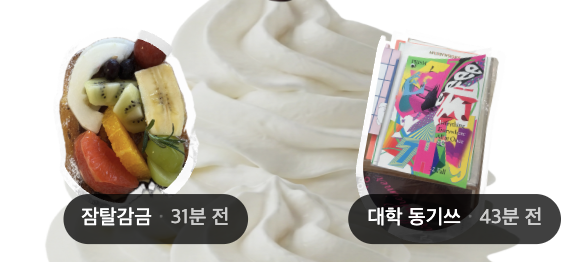

# 무한 파르페

## 정의

`G-001`(그룹 목록)의 시각 구조다. 화면 전체가 **파르페 잔 하나**이고, 가입한
그룹이 늘수록 잔이 아래로 무한히 길어진다. 각 그룹은 자기 대표 토핑 한 개로
잔 위에 올라간다.

제품명 parfait와 [[canvas]] 위의 "토핑"에 이어, **디저트 은유가 화면 구조까지
내려온 지점**이다.

근거는 정책서 넷인데 **서로 어긋나는 대목이 있다.** 배치와 규격의 현행 정본은
[[src-G-001-무한파르페-간격-정책-v0.2]](07-22)다 —
[[src-G-001-무한파르페-정책설계]](06-13)의 배치,
[[src-G-001-무한파르페-간격-정책-v0.1]](07-09)의 갭,
[[src-G-001-토핑-정책-v0.1]](07-09)의 규격을 각각 뒤집거나 다시 적었다.

## 구성 요소

| 요소 | 무엇 | z-index |
|---|---|---|
| 토핑 (`Img` + `Grouptag-Chip`) | 그룹 대표 이미지와 이름 칩 | 4 |
| 체리 | 기능 없음. `TBD` | 3 |
| 크림 | 토핑이 얹히는 바탕. 그룹 수만큼 늘고 준다 | 2 |
| 접시 | 기능 없음. 잔의 바닥 | 1 |

체리와 접시는 지금 아무 동작도 하지 않는다. 그래도 z-index가 배정된 것은 장식이
레이어로 관리된다는 뜻이다.

토핑 안에서는 **`Img`가 `Grouptag-Chip`보다 위**다
([[src-G-001-토핑-정책-v0.1]]).

## 토핑 컴포넌트

| 항목 | v0.2 (07-22) | 토핑 정책서 (07-09) |
|---|---|---|
| 토핑 프레임 | **160×160** | 180×180 |
| `Img` | **96×96**, 프레임 정중앙 | 144×144 |
| 타입 수 | **6** | 3 |

> ⚠️ [2026-09-17] [[src-G-001-무한파르페-간격-정책-v0.2]] 와
> [[src-G-001-토핑-정책-v0.1]] 이 상충 — 같은 컴포넌트의 규격과 타입 체계를 다르게
> 적는다. `v0.2`가 11일 늦지만 토핑 정책서를 "연관 문서"로만 들고 **대체를
> 선언하지 않았다** → [[open-questions]]

아래는 `v0.2` 기준이다. `Img`가 프레임의 60%로, 이전 80%보다 여백이 넓어졌다.

토핑은 **`Img` + `Grouptag-Chip`**이고 `Chip`은 회전하지 않는다. Z는 항상
**`Img` > `Grouptag-Chip`**이다. `Chip`의 배치 기준점은 `프레임 중앙 하단`과
`Img 중앙 하단` 사이에서 **아직 고르지 않았다.**

### 타입마다 고정 변형이 붙는다

정중앙(오프셋 0) 기준으로 타입이 값을 정한다. **사용자 데이터가 아니다.**

| 타입 | Translate X | Translate Y | Rotate | Chip Offset |
|---|---|---|---|---|
| `Left-1` | 26 | 16 | **6°** | -7 |
| `Left-2` | 24 | 11 | **12°** | -5 |
| `Left-3` | 25 | 16 | **-8°** | -8 |
| `Right-1` | 26 | 16 | **-6°** | -6 |
| `Right-2` | 22 | 8 | **-16°** | -3 |
| `Right-3` | 25 | 16 | **-8°** | -8 |

`Left-3`와 `Right-3`가 값이 완전히 같다. 의도인지 복사 흔적인지 알 수 없다.

**같은 사이드의 `1`·`2`·`3` 중 무엇을 쓸지 정하는 규칙이 없다.** 인덱스 규칙은
좌우만 가른다.

`C-305`에서 사용자가 준 토핑 각도([[canvas]])가 이 고정 회전과 어떻게 합쳐지는지는
정해지지 않았다.

### 프레임 밖은 자르지 않는다

`Img`를 회전·이동하면 코너가 프레임을 넘어간다. 누끼가 거의 따지지 않은 풀블리드
사진에서 특히 심하다. **삐져나온 부분을 그대로 노출한다**(`Clip Contents OFF`).
프레임 경계에서 잘라내는 것은 원본이 "이건 아님!"이라고 못박았다
([[src-G-001-토핑-정책-v0.1]]).

근거가 적혀 있다 — 삐져나온 픽셀은 인접 토핑을 밀지 않으므로, 자르지 않고 다
노출해 자연스러운 분위기를 살린다.

간격도 프레임 기준으로 잰다. 삐져나온 픽셀은 측정 대상이 아니다.

## 지그재그 배치 (v0.2)

**행당 토핑 하나**를 좌/우로 번갈아 놓고 아래로 무한히 잇는다.

```
[ Left ]           [ Right ] [ Left ]           [ Right ] [ Left ]    ......
```

인덱스를 0부터 셀 때 **2개 단위로 반복**한다.

| `index % 2` | 자리 |
|---|---|
| 0 | `Left` |
| 1 | `Right` |

**첫 토핑이 왼쪽에서 시작하는지 오른쪽에서 시작하는지는 아직 고르지 않았다** —
원본이 `[ Left / Right ]`로 두 후보를 나란히 적었다.

### 2-1-2-1은 폐기됐다

`v0.2` 이전의 배치는 2열과 1열을 섞는 "`2-1-2-1` 스태거"였다. 세 문서가 **2열이
먼저냐 1열이 먼저냐**를 두고 갈렸는데, `v0.2`가 패턴 자체를 없애면서 그 다툼이
끝났다 — 어느 쪽이 맞는지 밝혀진 것이 아니라 물음이 사라졌다.

같은 이유로 `Type 1` / `Type 2-Left` / `Type 2-Right` 체계와 그에 딸린 갭 표
(좌우가 12px 어긋나던 스태거)도 함께 무효가 됐다. 경위는
[[spec-version-history]]에 있다.

### 저개수

- **N = 0** — 토핑 없음, **툴팁** 노출.
- **N = 1**, **N = 2** — **`v0.2`에 항목만 있고 내용이 비어 있다.**
- **N = 3** — 여기까지 스크롤이 없고 파르페가 늘어나지 않는다. **4부터** 크림
  개수가 늘어난다.

[[src-G-001-무한파르페-정책설계]]는 `N = 0`에 크림 최소 + 접시와 문구
`"첫 그룹을 만들어 / 파르페를 쌓아보세요"`를, `N = 1`에 "가운데 1개"를 적었다.
`v0.2`의 "툴팁"이 그 문구인지, `N = 1`의 가운데 배치가 지그재그에서도 유지되는지
알 수 없다.

### 그룹을 나가면 당겨진다

**빈자리를 남기지 않는다.** 나간 토핑 뒤의 것들이 가입순 그대로 한 칸씩 올라오고,
`N` → `N−1`로 패턴 전체가 재계산된다. 마지막 행의 모양과 전체 행 수가 바뀔 수
있고, 크림은 그만큼 수축하며 접시가 위로 올라온다.

반영은 저장·화면 재진입 시점이다. **실시간이 아니다** — 기존 동기화 정책을
따른다. 도메인 쪽 서술은 [[group]]에 있다.

## 라벨

이름 칩은 한 줄 고정이고 토핑 우측 하단에 붙는다. 칩 폭은 토핑 폭에 종속되지
않고 내용 기준으로 늘어난다.

- **그룹 이름 잘림 기준이 판본 사이에서 바뀌었다.** 배치 정책서(06-13)는 **최대
  6자**, 7자 이상이면 앞 5자 + `…`이라 했고(예: `우리동네산책모임` →
  `우리동네산…`), [[src-G-001-무한파르페-간격-정책-v0.2]](07-22)는 **80px 초과 시**
  이후를 `...`로 자른다고 한다. 글자 수 기준에서 픽셀 기준으로 옮겨갔는데 80px에
  몇 자가 들어가는지 서술이 없다.
- 시간 텍스트(`· N분 전`)는 **항상 전체 노출**하고 줄이지 않는다.
- 그 **Timestamp 텍스트 컬러**는 올린 사람의 `Nametag-Chip` 타입에 따라 매핑된다
  ([[src-S-101-프로필-닉네임-컬러-규칙-v0.2]]). 타입은 계정에 고정이고 12종뿐이라
  **같은 그룹 목록에 같은 색이 여럿 나올 수 있다**([[account]]).

**입력 한도는 10자다**([[src-A-005-그룹명-정책-v0.1]]). 표시 한도가 6자든 80px든
입력 가능 범위의 상당 부분이 목록에서 잘린다. 의도된 것인지 서술이 없다.

이것은 목록 칩의 표기 규칙이지 닉네임 정책이 아니다. 그룹 내 닉네임 글자수는
별개이며 여전히 정해지지 않았다([[group]]).

### 상대 시간

대표 토핑의 **마지막 활동 시각** 기준이다.

| 경과 | 표기 |
|---|---|
| 60초 미만 | 방금 전 |
| 1분 ~ 59분 | N분 전 |
| 1시간 ~ 23시간 | N시간 전 |
| 1일 ~ 6일 | N일 전 |
| 7일 이상 | 오래 전 |

### NEW 표시

**그룹을 실제로 열어야 읽은 것으로 본다** — `C-001`에 진입해야 한다. 목록에서
스크롤로 스쳐 지나가는 것만으로는 NEW가 사라지지 않는다.

서버에 unread 데이터가 없을 때의 폴백은 `lastActivityAt`이 **24시간 이내**면
NEW다.

## 조회와 갱신

- **페이지네이션이 없다.** 한 번의 API 호출로 전체를 가져온다.
- 받아오는 필드는 넷 — 그룹 ID, 프리뷰 이미지, 이름, 활동 시간.
- **정렬은 활동순이다.** 투표로 정해졌고 근거가 남은 유일한 결정이다
  ([[src-G-001-무한파르페-정책설계]]).
- Pull-to-Refresh로 전체 목록을 다시 조회하고 **기존 리스트를 통째로 교체**하며
  스크롤은 최상단으로 돌린다.
- 프리뷰 이미지는 **지연 로딩 + 캐싱**한다.

## 크림 정렬 (미결)

크림의 가로 길이가 두 안 사이에서 정해지지 않았다.

- **1안** — 그리드 전체 폭과 동일. 토핑이 크림 밖으로 나갈 여지가 없다.
- **2안** — 풀행일 때 그리드 요소 중앙에 정렬. "개발해보고 안되면 패스 가능".



## 미결

- **토핑 규격과 타입 체계**가 두 정책서에서 어긋난다(위 상충 마커).
- 6타입 중 `1`·`2`·`3`을 고르는 규칙이 없다.
- 시작 사이드와 `Chip` 배치 기준점이 택일 미정이다.
- `N = 1`·`N = 2`의 배치 내용이 비어 있다.
- 그룹명 잘림 기준이 글자 수에서 픽셀로 바뀌었다.
- `C-305`의 사용자 회전과 목록의 타입별 고정 회전이 어떻게 합쳐지는지.
- 칩 타입이 12종뿐이라 같은 그룹 목록에 같은 색이 여럿 나올 수 있다.
- 크림 가로 길이 1안 대 2안.
- 체리의 기능(`TBD`).
- 토핑 이미지 뷰어 정책.
- 화면 재진입 시 자동 재조회 여부.
- 그룹 데이터 캐싱 여부 — 취소선으로 지워졌을 뿐 답이 나오지 않았다.

전부 [[open-questions]]에 있다.

## 연관

- [[src-G-001-무한파르페-간격-정책-v0.2]]
- [[src-G-001-무한파르페-정책설계]]
- [[src-G-001-무한파르페-간격-정책-v0.1]]
- [[src-G-001-토핑-정책-v0.1]]
- [[src-S-101-프로필-닉네임-컬러-규칙-v0.2]]
- [[src-A-005-그룹명-정책-v0.1]]
- [[src-기능정의서-v5]]
- [[group]]
- [[parfait]]
- [[canvas]]
- [[screen-id-scheme]]
