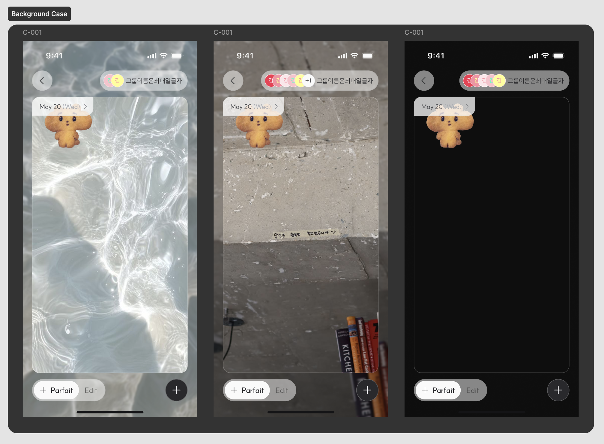

# 캔버스 정책 v0.1 (C-001)

## 요약

`C-001`(그룹 캔버스 메인)의 **반응형 레이아웃과 Background Blur**를 정한다.
2026년 7월 9일자 `v0.1` 초안이고 작성자는 `DSN-A`다. 정책 이미지 1장과 Background
Case 목업 1장에서 옮겼다.

[[src-G-001-무한파르페-정책설계]], [[src-A-005-그룹명-정책-v0.1]]에 이은 **정책
설계서 계열 세 번째 문서**다. 기능정의서와 서로 대체하지 않는다 — 두 계열의
관계는 [[spec-version-history]]에 있다.

## 세로 모드 전용

**태블릿과 가로모드를 고려하지 않는다.** 근거는 적혀 있지 않고 "미고려"라고만
적혔다. 범위 결정이므로 [[mvp-scope-limits]]에 넣었다.

## 레이아웃 우선순위

캔버스 크기와 위치를 정할 때 **셋을 이 순서로 지킨다.**

1. **16:9 비율을 무조건 유지한다.**
2. 탑바–탭바 사이 상하 **최소 gap 12px**를 보장한다.
3. 좌우 패딩 **20px**를 유지한다 — 가능한 한도 내에서.

셋째만 조건부다. 셋이 충돌하면 캔버스가 줄고 좌우 여백이 늘어난다.

| 상황 | 결과 |
|---|---|
| 세로 공간이 충분한 평소 | 좌우 패딩 20px 유지. 캔버스 너비 = 탑바·탭바 너비 |
| 가로가 상대적으로 넓어 세로가 부족 | 12px gap을 먼저 보장하느라 캔버스가 축소되고 **좌우 패딩이 20px보다 커진다.** 캔버스가 탑바·탭바보다 좁아 보일 수 있다 |

배치는 탑바–탭바 사이 **세로 중앙 정렬**이고, 상단 갭과 하단 갭은 **항상 같은
값**이다.

## 고정되는 것과 스케일되는 것

| 요소 | 동작 |
|---|---|
| 탑바 / 탭바 | 플로팅 버튼 형태로 화면 상·하단 고정. 좌우 패딩 20px 고정 |
| 날짜 라벨 | **크기 고정** — 화면 크기와 무관하게 스케일되지 않는다. 위치는 캔버스 기준 좌상단 |
| 캔버스 내부 요소 전부 | 캔버스 크기 변화에 **비례해 같은 비율로** 스케일 |

날짜 라벨만 예외적으로 스케일에서 빠진다. 표기 예시는 `May 20 (Wed)`로 **영문**
이다.

이 문서가 캔버스에 날짜가 표시된다는 사실을 처음 기록한다 — 기능정의서 네 판본은
`C-001`의 표시 요소로 배경·이미지·업로더 닉네임만 적었다.

## Background Blur

**배경이 무엇이든, 배경이 없어도 항상 적용한다.** 배경 전체를 덮는 도형을 별도
레이어로 깐다.

| 설정 | 값 |
|---|---|
| Fill | Transparency / Black-25 |
| Effect | Background blur |
| Blur 방식 | Uniform |
| Blur 값 | 4 |

목업은 물 이미지·콘크리트 이미지·검정 단색 셋을 나란히 두고 **어떤 배경에서도
같은 도형이 적용됨**을 보여준다.

왜 항상 적용하는지는 적혀 있지 않다. 배경 위에 얹힌 토핑의 가독성을 위한 것으로
보이지만 원본의 서술이 아니다.

## 기능정의서와의 관계

어긋나지 않고 보완한다. [[src-기능정의서-v5]]가 `SY-001-new`에 적은 "16:9
비율"을 이 문서가 **최우선 제약**으로 격상하고, 그 비율을 지키기 위해 무엇을
양보할지까지 정한다.

## 미결

- 태블릿·가로모드를 왜 보지 않는지.
- Background Blur를 항상 적용하는 근거.
- 캔버스의 **기본 배경**은 여전히 정해지지 않았다. 이 문서는 표시 레이아웃을
  정하지 캔버스가 처음 생성될 때 무엇을 담는지는 다루지 않는다.

전부 [[open-questions]]에 있다.

## 연관

- [[src-G-001-무한파르페-정책설계]]
- [[src-A-005-그룹명-정책-v0.1]]
- [[src-기능정의서-v5]]
- [[canvas]]
- [[topping-placement-pipeline]]
- [[mvp-scope-limits]]
- [[spec-version-history]]
