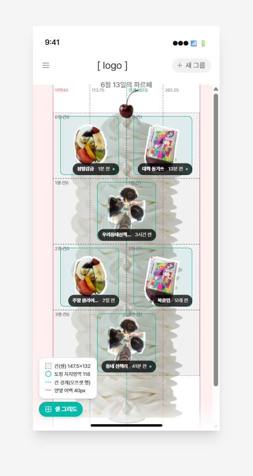

# 무한 파르페 정책 설계 (G-001)

## 요약

`G-001`(그룹 목록) **한 화면만 다루는 정책 설계서**다. 2026년 6월 13일자이며,
Notion 페이지 export와 이미지 2장에서 옮겼다.

**기능정의서 판본군과 다른 계열의 문서다.** 기능정의서가 화면 전체를 한 줄씩
정의한다면 이 문서는 화면 하나를 끝까지 파고든다 — 데이터 모델, 조회·갱신 정책,
그리드 배치 규칙, 요소별 z-index, 라벨 표기 기준까지. 그래서 대체 관계가 없다.

팀원 실명은 public 저장소를 고려해 역할 코드(`DSN-*`/`iOS-*`/`AOS-*`/`SPR-*`)로
마스킹된 상태로 들어왔다.

## 핵심 주장

- **그룹 목록은 파르페 잔 하나다.** 그룹이 늘수록 템플릿이 아래로 무한히
  길어지고, 각 그룹의 최신 대표 토핑이 **2-1-2-1 스태거 패턴**으로 크림 위에
  쌓인다. 구조는 [[infinite-parfait]]에 있다.
- **정렬은 활동순이다.** 투표에서 9명이 활동순을 골랐고 가입순·이름순에는 표가
  없다. 아래 "결정과 그 근거"를 본다.
- **페이지네이션이 없다.** 그룹 목록은 한 번의 API 호출로 전체를 조회한다.
  갱신은 Pull-to-Refresh로 전체 교체하고 스크롤은 최상단으로 초기화한다.
- **조회 필드를 넷으로 한정한다** — 그룹 ID, 프리뷰 이미지(대표 토핑), 이름,
  활동 시간. [[src-기능정의서-v5]]가 정한 `G-001` 노출 정책과 어긋나지 않는다.
  그쪽이 "무엇을 보여줄지"라면 이쪽은 "무엇을 받아올지"다.
- **그룹을 나가면 빈자리 없이 당겨진다.** 뒤 토핑들이 가입순 그대로 한 칸씩
  올라오고 `N` → `N−1`로 패턴 전체가 재계산된다. 크림이 수축하고 접시가 올라온다.
  반영은 저장·화면 재진입 시점이고 실시간이 아니다. [[group]]에 있다.

## 결정과 그 근거

**이 위키가 처음 받은 "근거가 적힌 결정"이다.**

정렬 기준을 두고 가입순·활동순·이름순 셋을 놓고 투표했고, **활동순에 9명이
이름을 적었다**(`AOS-A`·`AOS-B`·`AOS-C`·`iOS-A`·`DSN-A`·`DSN-B`·`SPR-A`·`SPR-B`·
`SPR-C`). 나머지 둘에는 표가 없다.

근거도 한 줄 남았다 — `AOS-A`: "자주 보는 게 위로 올라와야 편의성에 좋을 것
같은데 그러려면 활동순이 좋을 것 같음".

기능정의서 네 판본이 한 번도 근거를 적지 않은 것과 대비된다
([[mvp-scope-limits]]).

다만 **"활동순으로 한다"는 확정 문장은 없다.** 투표 결과만 있다.

## 기능정의서에 반영되지 않았다

이 문서는 2026-06-13자이고, **하루 뒤**인 2026-06-14의
[[src-기능정의서-v4]]는 `G-001` 비고에 여전히 "그룹 정렬 기준 정의 필요"를
달았다. [[src-기능정의서-v5]]는 비고 열 자체를 지웠다.

정책 설계서에서 정해진 것이 기능정의서로 넘어가지 않는다. 두 계열이 따로 도는
셈이라 **어느 쪽이 정본인지가 화면마다 갈릴 수 있다.**

## 화면 ID를 케이스로 쪼갠다

이 문서는 `G-001 Empty Case`, `G-001 Error Case`처럼 **한 화면 ID 아래 상태별
케이스**를 둔다. [[src-기능정의서-v5]]가 `C-101-error` 같은 접미사 ID를 쓴 것과
같은 필요에 대한 다른 표기다 — [[screen-id-scheme]]에 있다.

| 상태 | 화면 표현 |
|---|---|
| 초기 로딩 | 로딩 인디케이터 또는 스켈레톤 UI |
| 조회 성공 | 전체 리스트 + 스크롤 |
| 조회 0건 | `G-001 Empty Case` |
| 조회 실패 | `G-001 Error Case` + 새로고침 버튼 |

## 시뮬레이션

피그마 시뮬레이션이 제공됐고 의도대로 동작하는 것을 확인했다. 토핑을 클릭하면
`C-001`로 가야 하지만 시뮬레이션에는 미구현이라 그룹 삭제 바텀시트가 뜬다 —
그룹 수를 조정해 패턴을 확인하는 용도다.

- <https://model-turn-68745673.figma.site/>

## 미결

- 크림 가로 길이가 1안(그리드 전체 폭)과 2안(풀행 중앙 정렬) 사이에서 정해지지
  않았다. 2안은 "개발해보고 안되면 패스 가능"이다.
- 체리는 `TBD`다. 기능이 없고 차후에 붙을 수 있다고만 적혔다.
- 토핑 이미지 뷰어 정책이 "다음에.. 누군가 정해야 함"으로 남았다.
- 2열·1열의 이름을 정해야 한다.
- 화면 재진입 시 자동 재조회 여부가 "정의에 따름"이다.
- 그룹 데이터 캐싱 여부는 **취소선으로 지워졌다.** 답이 적힌 것이 아니다
  ([[purpose]]).

전부 [[open-questions]]에 있다.

## 연관

- [[infinite-parfait]]
- [[src-기능정의서-v5]]
- [[src-기능정의서-v4]]
- [[group]]
- [[parfait]]
- [[screen-id-scheme]]
- [[mvp-scope-limits]]
