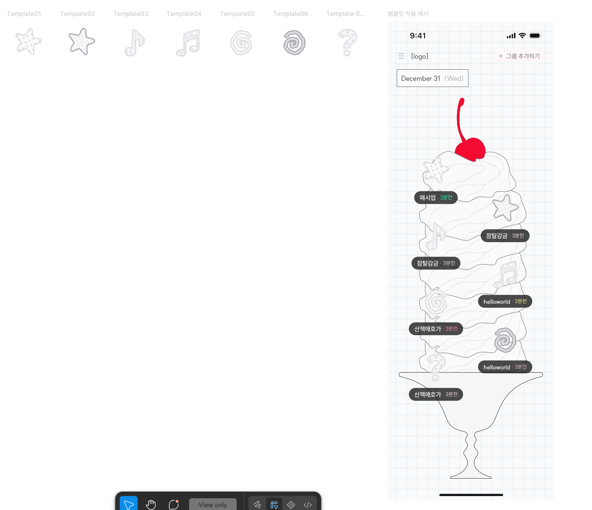

# 그룹 토핑 템플릿 — 1. Topping-Group

- **화면/컴포넌트**: G-001 (Topping-Group)
- **날짜**: 26.07.26
- **버전**: v0.2
- **작성자**: DSN-B
- **개정이력**:
  - v0.1 초안 작성
  - v0.2 빈 캔버스 템플릿 및 에러 템플릿 이미지 추가

> 🔒 **실명 마스킹됨**: public repo이므로 작성자 실명을 역할 코드(DSN-B)로 마스킹함.

## 1. 특정 토핑 조회 실패 시

- 그룹 칩은 정상 노출함.
- 토핑 영역에는 물음표 모양 형태의 '조회 실패 그래픽(1종)'을 노출함.

## 2. 특정 토핑 내 이미지가 없는 경우

- 해당 그룹에 첫 토핑이 올 때까지 '토핑 템플릿 그래픽'을 노출함.
- 템플릿 종류: 총 6종, 하단 참고
- 6종 중 1종이 랜덤으로 최초 부여되며, 첫 토핑이 등록되기 전까지는 고정 유지됨.
- 새로고침, 재접속, 타 그룹 갱신 등 상태 변화가 발생해도 이미 부여된 그래픽은 변경되지 않음.

## 3. 템플릿 이미지 (v0.2 추가)

에셋 시트에 표기된 이름과 형태는 다음과 같다. 전부 회색 계열 반투명 아웃라인 스타일이다.

| 에셋명 | 형태 |
|---|---|
| Template01 | 별 모양 (도트 무늬) |
| Template02 | 별 모양 (격자 무늬) |
| Template03 | 음표 (8분음표) |
| Template04 | 음표 (쌍음표) |
| Template05 | 소용돌이 (가는 선) |
| Template06 | 소용돌이 (굵은 선) |
| Template-E… (Error) | 물음표 |

우측 '템플릿 적용 예시'는 파르페 위에 템플릿 그래픽이 얹힌 G-001 화면 목업이다. 템플릿 그래픽도 일반 토핑과 동일하게 지그재그 배치·그룹 칩 노출 규칙을 따른다.
